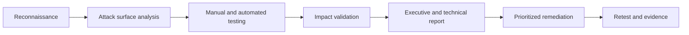

<!--
  Primitive Labs - GitHub Profile README
  English version. Spanish version: README.md
-->

  

  
  

  <strong>Selected language:</strong> English

  

  
  

  
  
  
  

  

---

<h2 align="center">Primitive Labs</h2>

  <strong>Cybersecurity, penetration testing, hardening, WAF and secure web development</strong> 
  for companies that need to operate with confidence across Spain, Europe and international markets.

  <a href="https://www.primitivelabs.io/en"><strong>Request a security assessment</strong></a>
  &nbsp;&middot;&nbsp;
  <a href="https://www.primitivelabs.io/en/services"><strong>View services</strong></a>
  &nbsp;&middot;&nbsp;
  <a href="https://www.primitivelabs.io/en/contact"><strong>Talk to the team</strong></a>

---

### `> positioning`

**Primitive Labs protects your business before an attacker puts it to the test.**

We are a **cybersecurity and secure development company based in Oliva, Valencia**, built for organizations that depend on websites, SaaS products, ecommerce, servers, APIs, corporate email and customer data.

We do not sell noise, fear or reports that cannot be acted on. We deliver **technical clarity, real priorities and applicable remediation**: what fails, why it matters, how to fix it and which evidence proves the risk has been reduced.

> Security should not be a polished PDF after the damage. It should be an operational advantage before the incident.

---

### `> what_we_do`

  

| Area | Business outcome |
|:---|:---|
| **Web and API pentesting** | We find exploitable vulnerabilities before they affect customers, data or business continuity. |
| **OWASP audits** | Assessment against OWASP Top 10, OWASP API Security, ASVS, PTES and CVSS with clear evidence. |
| **Server hardening** | Linux, Windows, Nginx, Apache, SSH, Docker, backups, security headers and exposed surface reduction. |
| **Web protection / WAF** | Defense against abuse, DDoS, bots, injections, leaks and common attack patterns. |
| **Secure web development** | Websites, SaaS, dashboards and APIs with security across architecture, permissions, validation, performance and deployment. |
| **DevSecOps and automation** | CI/CD, scripts, integrations and traceable workflows to reduce human error and operational debt. |
| **Incident response** | Containment, analysis, recovery and hardening plans when an active threat already exists. |
| **Consulting and compliance** | Technical controls, evidence and roadmaps for GDPR, ISO 27001, ENS, NIS2 and supplier requirements. |

---

### `> why_primitivelabs`

<table>
  <tr>
    <td width="33%" align="center">
      <h3>Security + development</h3>
      
We find weaknesses, but we also know how to fix architecture, backend, frontend, APIs, servers, CI/CD and performance.

    </td>
    <td width="33%" align="center">
      <h3>Actionable reports</h3>
      
Leadership understands impact. Technical teams understand remediation. We prioritize by severity, exploitability and business risk.

    </td>
    <td width="33%" align="center">
      <h3>Offensive mindset</h3>
      
We think like attackers, work like a technical partner and document like a serious company requires.

    </td>
  </tr>
  <tr>
    <td width="33%" align="center">
      <h3>Clear remediation</h3>
      
We do not leave clients with a list of problems. We build an ordered roadmap to close risk.

    </td>
    <td width="33%" align="center">
      <h3>Recognized methodologies</h3>
      
OWASP, MITRE ATT&amp;CK, CIS Benchmarks, NIST, CVSS and production best practices as a shared language.

    </td>
    <td width="33%" align="center">
      <h3>International reach</h3>
      
Based in Valencia, remote delivery and ES/EN communication for projects in Spain, Europe and global markets.

    </td>
  </tr>
</table>

---

### `> methodology`

  

---

### `> operating_stack`

  
  
  
  
  

  
  
  
  
  

---

### `> who_we_help`

| Profile | How we help |
|:---|:---|
| **SMBs without an internal security team** | We turn security into concrete actions: MFA, backups, WAF, hardening, updates, training and exposed-service reviews. |
| **SaaS, ecommerce and digital platforms** | We protect authentication, permissions, APIs, payments, customer data, deployments and performance. |
| **Companies facing audits or demanding suppliers** | We prepare evidence, technical controls and documentation to answer security and compliance requirements. |
| **Teams that have suffered an incident** | We contain, analyze, recover and harden so the same vector does not get in again. |

---

### `> repositories`

This GitHub is our public lab: tools, tests, resources, automations, applied research and components that reflect how we work.

  
  

  

  Note: if this README is used in an organization, some public GitHub cards may depend on external API availability.

---

<h2 align="center">Your website, API or server should withstand a real test.</h2>

  <strong>Talk to us before an attacker does.</strong>

  

  <strong>Primitive Labs</strong> 
  Cybersecurity, penetration testing and secure development 
  Passeig Joan Fuster 3, Entresuelo Dcha. Oliva, Valencia, Spain 
  <a href="https://www.primitivelabs.io">www.primitivelabs.io</a> &middot; <a href="mailto:info@primitivelabs.io">info@primitivelabs.io</a>

  

