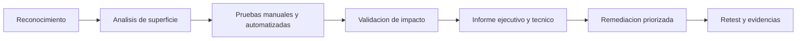

<!--
  Primitive Labs - GitHub Profile README
  Spanish version. English version: README.en.md
-->

  

  
  

  <strong>Idioma seleccionado:</strong> Espa&ntilde;ol

  

  
  

  
  
  
  

  

---

<h2 align="center">Primitive Labs</h2>

  <strong>Ciberseguridad, pentesting, hardening, WAF y desarrollo web seguro</strong> 
  para empresas que necesitan operar con confianza en Espa&ntilde;a, Europa y mercados internacionales.

  <a href="https://www.primitivelabs.io"><strong>Solicitar diagn&oacute;stico de seguridad</strong></a>
  &nbsp;&middot;&nbsp;
  <a href="https://www.primitivelabs.io/es/servicios"><strong>Ver servicios</strong></a>
  &nbsp;&middot;&nbsp;
  <a href="https://www.primitivelabs.io/es/contacto"><strong>Hablar con el equipo</strong></a>

---

### `> posicionamiento`

**Primitive Labs protege tu negocio antes de que un atacante lo ponga a prueba.**

Somos una empresa de **ciberseguridad y desarrollo seguro con sede en Oliva, Valencia**, creada para organizaciones que dependen de webs, SaaS, ecommerce, servidores, APIs, correo corporativo y datos de clientes.

No vendemos ruido, miedo ni informes imposibles de accionar. Entregamos **claridad t&eacute;cnica, prioridades reales y remediaci&oacute;n aplicable**: qu&eacute; falla, por qu&eacute; importa, c&oacute;mo se corrige y qu&eacute; evidencia demuestra que el riesgo se ha reducido.

> La seguridad no deber&iacute;a ser un PDF bonito despu&eacute;s del susto. Deber&iacute;a ser una ventaja operativa antes del incidente.

---

### `> lo_que_hacemos`

  

| &Aacute;rea | Resultado para tu empresa |
|:---|:---|
| **Pentesting web y API** | Encontramos vulnerabilidades explotables antes de que afecten a clientes, datos o continuidad. |
| **Auditor&iacute;as OWASP** | Evaluaci&oacute;n contra OWASP Top 10, OWASP API Security, ASVS, PTES y CVSS con evidencias claras. |
| **Hardening de servidores** | Bastionado de Linux, Windows, Nginx, Apache, SSH, Docker, backups, cabeceras y superficie expuesta. |
| **Protecci&oacute;n Web / WAF** | Defensa frente a abuso, DDoS, bots, inyecciones, fugas y patrones de ataque frecuentes. |
| **Desarrollo web seguro** | Webs, SaaS, dashboards y APIs con seguridad desde arquitectura, permisos, validaci&oacute;n, rendimiento y despliegue. |
| **DevSecOps y automatizaci&oacute;n** | CI/CD, scripts, integraciones y flujos trazables para reducir errores humanos y deuda operativa. |
| **Respuesta ante incidentes** | Contenci&oacute;n, an&aacute;lisis, recuperaci&oacute;n y plan de endurecimiento cuando ya existe una amenaza activa. |
| **Consultor&iacute;a y cumplimiento** | Controles t&eacute;cnicos, evidencias y hoja de ruta para RGPD, ISO 27001, ENS, NIS2 y requisitos de proveedores. |

---

### `> por_que_primitivelabs`

<table>
  <tr>
    <td width="33%" align="center">
      <h3>Seguridad + desarrollo</h3>
      
Detectamos fallos, pero tambi&eacute;n sabemos corregir arquitectura, backend, frontend, APIs, servidores, CI/CD y rendimiento.

    </td>
    <td width="33%" align="center">
      <h3>Informes accionables</h3>
      
Direcci&oacute;n entiende impacto. El equipo t&eacute;cnico entiende soluci&oacute;n. Priorizamos por criticidad, explotabilidad y negocio.

    </td>
    <td width="33%" align="center">
      <h3>Visi&oacute;n ofensiva</h3>
      
Pensamos como un atacante, trabajamos como un partner t&eacute;cnico y documentamos como exige una empresa seria.

    </td>
  </tr>
  <tr>
    <td width="33%" align="center">
      <h3>Remediaci&oacute;n clara</h3>
      
No dejamos al cliente con una lista de problemas. Creamos una hoja de ruta para cerrar riesgo con orden.

    </td>
    <td width="33%" align="center">
      <h3>Metodolog&iacute;as reconocibles</h3>
      
OWASP, MITRE ATT&amp;CK, CIS Benchmarks, NIST, CVSS y buenas pr&aacute;cticas de producci&oacute;n como lenguaje com&uacute;n.

    </td>
    <td width="33%" align="center">
      <h3>Alcance internacional</h3>
      
Base en Valencia, ejecuci&oacute;n remota y comunicaci&oacute;n en ES/EN para proyectos en Espa&ntilde;a, Europa y mercados globales.

    </td>
  </tr>
</table>

---

### `> metodologia`

  

---

### `> stack_operativo`

  
  
  
  
  

  
  
  
  
  

---

### `> para_quien`

| Perfil | C&oacute;mo ayudamos |
|:---|:---|
| **Pymes sin equipo interno de seguridad** | Convertimos la seguridad en acciones concretas: MFA, backups, WAF, hardening, actualizaciones, formaci&oacute;n y revisi&oacute;n de servicios expuestos. |
| **SaaS, ecommerce y plataformas digitales** | Protegemos autenticaci&oacute;n, permisos, APIs, pagos, datos de clientes, despliegues y rendimiento. |
| **Empresas con auditor&iacute;as o proveedores exigentes** | Preparamos evidencias, controles t&eacute;cnicos y documentaci&oacute;n para responder a requisitos de seguridad y cumplimiento. |
| **Equipos que han sufrido un incidente** | Contenemos, analizamos, recuperamos y reforzamos para que el mismo vector no vuelva a entrar. |

---

### `> repositorios`

Este GitHub es nuestro laboratorio p&uacute;blico: herramientas, pruebas, recursos, automatizaciones, investigaci&oacute;n aplicada y componentes que reflejan nuestra forma de trabajar.

  
  

  

  Nota: si este README se usa en una organizaci&oacute;n, algunas tarjetas p&uacute;blicas de GitHub pueden depender de la disponibilidad de APIs externas.

---

<h2 align="center">Tu web, API o servidor deber&iacute;an resistir una prueba real.</h2>

  <strong>Hablemos antes de que lo haga un atacante.</strong>

  

  <strong>Primitive Labs</strong> 
  Ciberseguridad, pentesting y desarrollo seguro 
  Passeig Joan Fuster 3, Entresuelo Dcha. Oliva, Valencia, Espa&ntilde;a 
  <a href="https://www.primitivelabs.io">www.primitivelabs.io</a> &middot; <a href="mailto:info@primitivelabs.io">info@primitivelabs.io</a>

  

